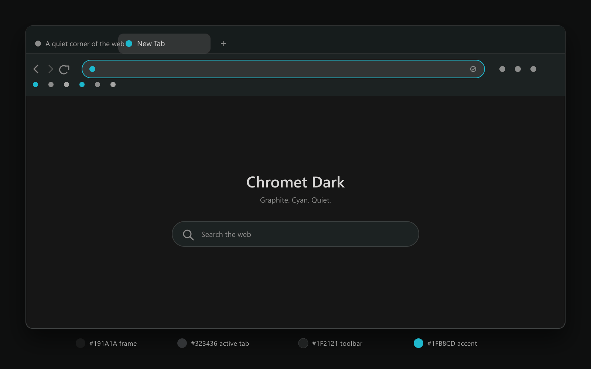

# Chromet Dark

**Chrome, but from beyond the solar system.**

A quiet graphite and cyan theme built around contrast, restraint, and getting Chrome's theme renderer to cooperate.



## What it changes

- Near-black window frame and inactive tabs
- A clearly lifted active tab that matches the address bar
- Dark toolbar and bookmarks surfaces
- A quieter content divider beneath the bookmarks bar
- Warm off-white text and muted gray controls
- A single cyan accent
- Dark New Tab page colors
- Matching inactive-window and Incognito states

Chromet Dark is a theme only. It contains no JavaScript, page access, permissions, analytics, or network requests.

## Install

### Chrome Web Store

The public listing is being prepared. A store link will be added here after publication.

### Load locally

1. Download or clone this repository.
2. Open `chrome://extensions` in Google Chrome.
3. Enable **Developer mode**.
4. Select **Load unpacked**.
5. Choose the [`theme`](theme) directory.

Chrome permits one active theme at a time. To remove Chromet Dark, open `chrome://settings/appearance` and select **Reset to default**.

## Palette

| Role | Color | RGB |
|---|---:|---:|
| Frame and inactive tabs | `#191A1A` | 25, 26, 26 |
| Active tab and address bar | `#323436` | 50, 52, 54 |
| Toolbar and bookmarks | `#1F2121` | 31, 33, 33 |
| Fine borders and separators | `#3D3F40` | 61, 63, 64 |
| Derived content divider | `#383A39` | 56, 58, 57 |
| Primary text | `#D6D5D4` | 214, 213, 212 |
| Toolbar icons | `#8C8D8C` | 140, 141, 140 |
| Cyan accent | `#1FB8CD` | 31, 184, 205 |
| New Tab background | `#171615` | 23, 22, 21 |

The full field map and the reasoning behind the derived colors are documented in [`docs/PALETTE.md`](docs/PALETTE.md).

## How it works

Chrome themes are Manifest V3 packages. The complete installable package lives in [`theme/`](theme) and contains only a manifest and PNG assets.

The unusual part is [`theme/images/toolbar.png`](theme/images/toolbar.png). Chrome uses the same toolbar image for the active tab and the toolbar, but samples it with different vertical offsets. A flat image would make both surfaces the same color, while a hard split creates an abrupt seam. Chromet Dark uses a short, carefully aligned transition instead:

- Image rows 0 through 47 are solid `#323436`.
- Image rows 48 through 63 blend from `#323436` to `#1F2121`.
- Image rows 64 through 199 are solid `#1F2121`.
- Chrome's vertical sampling places that blend around the visible active-tab and toolbar handoff.

Chrome does not provide an active-tab-only overlay, so part of the transition is also reused inside the toolbar. The short blend is an intentional compromise: it keeps the active tab readable, softens the native connected-tab shape, and avoids turning the whole toolbar gray. More detail is available in [`docs/TECHNICAL-NOTES.md`](docs/TECHNICAL-NOTES.md).

## Repository layout

```text
.
|-- .github/                  # Issue templates and automation
|-- assets/                   # Repository preview and store artwork
|-- docs/                     # Palette, technical, testing, and store notes
|-- scripts/                  # Asset build, validation, and packaging
|-- theme/                    # The actual Chrome theme package
|-- variants/colors-only/     # Conservative image-free fallback
|-- CHANGELOG.md
|-- CONTRIBUTING.md
|-- LICENSE
|-- PRIVACY.md
`-- package.json
```

## Development

### Prerequisites

- Node.js 20 or newer
- npm
- Google Chrome for visual testing

No Node dependencies are required to install the theme. Development dependencies are only used to rebuild and validate the PNG assets.

### Set up

```bash
git clone https://github.com/daveotero/chromet-dark.git
cd chromet-dark
npm install
```

### Rebuild generated assets

```bash
npm run build
```

This regenerates:

- Theme icons at 16, 32, 48, and 128 pixels
- The aligned toolbar-transition image
- The repository preview
- The 1280 by 800 store screenshot
- The 440 by 280 small promotional tile
- The optional 1400 by 560 marquee tile

### Validate

```bash
npm run validate
```

Validation checks the manifest schema, allowed theme keys, referenced files, icon dimensions, toolbar dimensions, exact toolbar transition pixels, version consistency, and the absence of executable code in the installable package.

### Create a Chrome Web Store ZIP

```bash
npm run package
```

The resulting file is written to `dist/chromet-dark-VERSION.zip`. Its `manifest.json` is at the ZIP root, as required by the Chrome Web Store.

### Run the full release check

```bash
npm run release:check
```

This rebuilds the generated assets, validates the theme, and creates the upload package.

## Visual testing

At minimum, test these states before a release:

- Normal, hovered, pinned, grouped, and narrow tabs
- Focused and unfocused address bar
- Omnibox suggestions
- Bookmarks bar with visible labels and folders
- Find bar with Ctrl+F
- Downloads, profile, extension, and site-information bubbles
- Restored and maximized windows
- Inactive Chrome window
- Incognito window
- Chrome restart
- Any monitor scaling factors you actively use

The complete checklist is in [`docs/TESTING.md`](docs/TESTING.md).

## Releases

The manifest and `package.json` versions should always match. Update [`CHANGELOG.md`](CHANGELOG.md), commit the change, and tag it:

```bash
git tag v1.4.0
git push origin main --tags
```

The release workflow validates the committed assets, creates the store-ready ZIP, and attaches it to a GitHub release.

## Privacy

Chromet Dark does not collect, store, transmit, sell, or share user data. See [`PRIVACY.md`](PRIVACY.md) for the complete statement and the suggested Chrome Web Store privacy responses.

## Contributing

Bug reports and careful visual refinements are welcome. Please read [`CONTRIBUTING.md`](CONTRIBUTING.md) before changing the palette or generated assets.

## License

Chromet Dark is released under the [MIT License](LICENSE).

## Independence

Chromet Dark is an independent, community-made theme. It is not affiliated with or endorsed by Google or any browser vendor. Google Chrome is a trademark of Google LLC.
